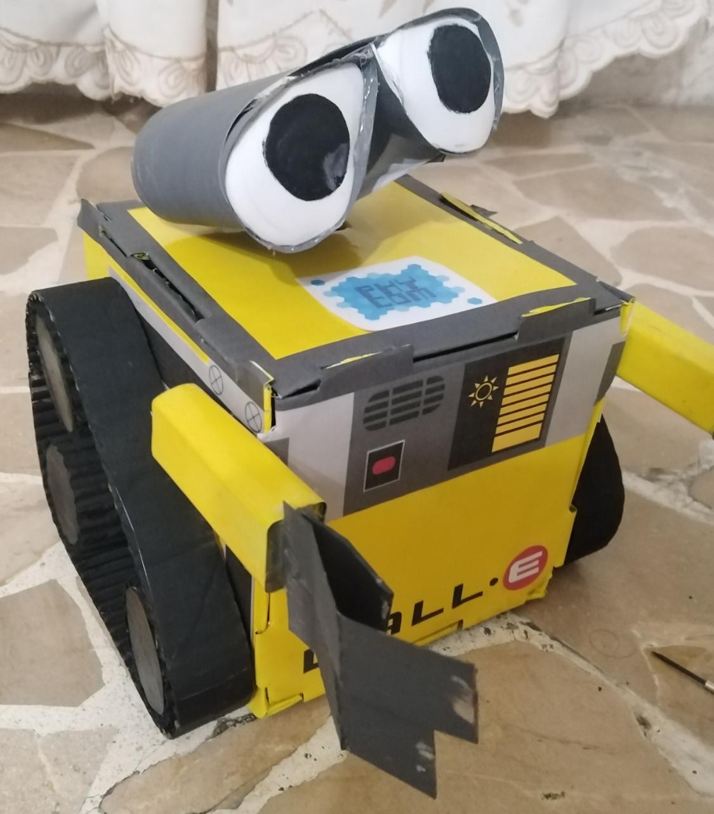
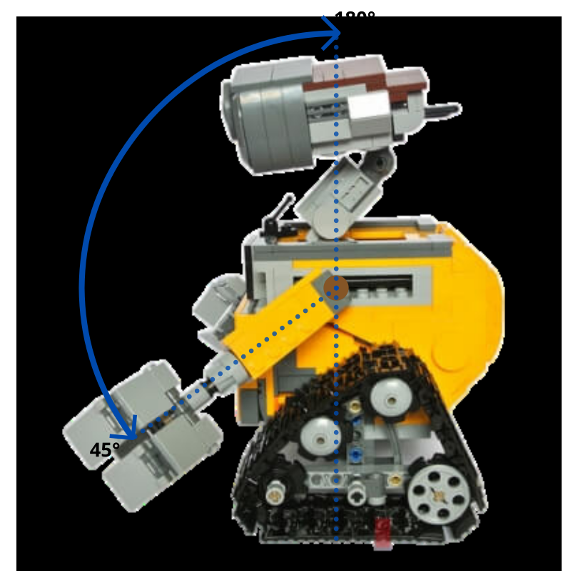

# RobotEco

Es una imitación del robot Wall-e (personaje de Disney).
Este robot tiene la capacidad de movilizarse con sus ruedas como de mover sus brazos, todo esto gracias a una aplicación que cumple la función de control remoto

## Materiales
| Descripción | Cantidad | Precio por unidad |
| --- | ---: | ---: |
| Arduino UNO R3 | 1 | $0.00 |
| Controlador L298N | 1 | $0.00 |
| Motor reductor | 2 | $0.00 |
| Baterias 9V | 2 | $0.00 |
| Servomotores | 2 | $0.00 |
| Bread board | 1 | $0.00 |
| Bluetooth HC-05 | 1 | $0.00 |

## Movilización
### Moverse en el espacio
El robot es prácticamento un vehículo movil en un espacio bidimensional. El modelo de conducción que aplicamos es el modelo diferencial.
El modelo de conducción diferencial se basa en modificar las velocidades de las dos ruedas para modificar el radio de la curva del giro y la velocidad tangencial del mismo.

El robot tiene movimientos simples con velocidades ya establecidas y no variables. Se mueve para adelante, atras, puede dar giros simples hacia la izquierda y derecha.
En la programación se considera esto al asignarle un valor de `HIGH` o `LOW` a los motores sin modificar sus rpm:

| Acción | Motor Izquierdo | retro_pin_I | Motor Derecho | retro_pin_D |
| --- | :---: | :---: | :---: | :---: |
| Avanzar | `HIGH` | `LOW` | `HIGH` | `LOW` |
| Retroceder | `HIGH` | `HIGH` | `HIGH` | `HIGH` |
| Giro Izquierda | `LOW` | `LOW` | `HIGH` | `LOW` |
| Giro Derecha | `HIGH`  | `LOW` | `LOW` | `LOW` |

Como se puede notar, para girar a la izquierda se tiene que mover el motor derecho y para girar a la derecha se tiene que mover el motor izquierdo, esto parte de una de las implicaciones del modelo diferencial, en donde se indica que se ejecuta un giro a la derecha si la velocidad de la rueda izquierda es mayor al de la derecha y viceversa. Para el caso específico de este proyecto, establecemos simplemente que una gira y la otra no, a esto nos referimos con que los giros son simples. En caso de querer modificar el radio de giro y la velocidad tangencial con la que se movería el robot, es preciso implementar un joystick en el control en vez de simplemente teclas direccionales y con ello modificar los rpm de cada uno de los motores.

En la variable "retro_pin" se indica si el motor gira en sentido de reversa. Si al momento de probar el giro de los motores ya con la aplicacion movil instalada y estos no giran en el sentido correcto, revise la conección de estos con el controlador L298n e invierta la conección de los cables del motor, por ejemplo: si el motor 1 tiene este problema, solo ponga el cable conectado al In1 en el In2 y el cable conectado en el In2 en el In1.

### Mover los Brazos
Los brazos, al contrario que el Wall-e real, tienen un largo definido e invariable, solo cambia el ángulo de su posición y para esto se usa un servomotor en cada brazo. Los brazos se pueden mover en un intervalo de ángulo de 45° - 180° (considerando como referencia que 0° es una pose de los brazos apuntando hacia abajo y 90° es una pose apuntado hacia adelante).

## Control Remoto
La aplicación movil del control remoto fue desarrollada en Android Studio, por lo que obviamente solo funcionará en dispositivos android. Esta se conecta con el arduino de forma inalambrica por bluetooth haciendo uso de un módulo `HC-05`.

El diseño de la app se hizo en [Illustrator](Illustrator/controles.ai) para luego exportar los diseños vectorizados con extención .svg. Los diseños implican las flechas direccionales, los íconos usados para el control de los brazos y el fondo de cruz que se ve en la imagen a continuación.

Desde la aplicación al arduino enviamos solo npumeros enteros, los cuales dependiendo de su valor interpretamos una acción diferente. A continuación una tabla con los valores enviados:

| Valor | Acción | Descripción |
| :---: | :---: | :--- |
| 1 | Avanzar | Mueve los dos motores  para avanzar |
| 2 | Girar a la Izquierda | Mueve solo el motor derecho |
| 3 | Retroceder | Mueve los dos motores en sentido opuesto para retroceder |
| 4 | Girar a la Derecha | Mueve solo el motor izquierdo |
| 10 - 145 | Mover Brazo Izquierdo | 
Mueve el servo izquierdo entre sus 45° a 180°   &nbsp;&nbsp; ◾ &nbsp;&nbsp;10 -> 45°   &nbsp;&nbsp;&nbsp;&nbsp;&nbsp;&nbsp;&nbsp;&nbsp;&nbsp;&nbsp;&nbsp;&nbsp;&nbsp;&nbsp;.  &nbsp;&nbsp;&nbsp;&nbsp;&nbsp;&nbsp;&nbsp;&nbsp;&nbsp;&nbsp;&nbsp;&nbsp;&nbsp;&nbsp;.  &nbsp;&nbsp;&nbsp;&nbsp;&nbsp;&nbsp;&nbsp;&nbsp;&nbsp;&nbsp;&nbsp;&nbsp;&nbsp;&nbsp;.  &nbsp;&nbsp; ◾ 145 -> 180°
 |
| 150 - 285 | Mover Brazo Derecho | 
Mueve el servo derecho entre sus 45° a 180°   &nbsp;&nbsp; ◾ 150 -> 45°   &nbsp;&nbsp;&nbsp;&nbsp;&nbsp;&nbsp;&nbsp;&nbsp;&nbsp;&nbsp;&nbsp;&nbsp;&nbsp;&nbsp;.  &nbsp;&nbsp;&nbsp;&nbsp;&nbsp;&nbsp;&nbsp;&nbsp;&nbsp;&nbsp;&nbsp;&nbsp;&nbsp;&nbsp;.  &nbsp;&nbsp;&nbsp;&nbsp;&nbsp;&nbsp;&nbsp;&nbsp;&nbsp;&nbsp;&nbsp;&nbsp;&nbsp;&nbsp;.  &nbsp;&nbsp; ◾ 285 -> 180°
 |

